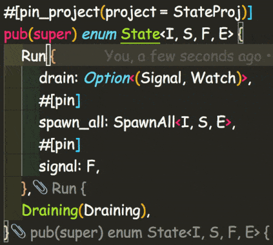

# Assorted Biscuits

Use assorted-biscuits to make code soup and spaghetti more digestible. Annotate ALL the end brackets!!!

Watch the text by the end brackets to see Biscuits in action.

Note: The explosion you see is [Power Mode](https://marketplace.visualstudio.com/items?itemName=hoovercj.vscode-power-mode)

## Supported Languages

Assorted Biscuits is named as such because it handles multiple languages. This functionality is provided by [Tree Sitter](https://github.com/tree-sitter/tree-sitter).

- C
- C#
- Elm
- Go
- Java
- JSON
- Kotlin
- Lua
- PHP
- Python
- Rust
- TOML
- YAML

We can add more as their grammars are made available as WebAssembly.

## Roadmap

Until we can bring HTML, SCSS, and TS into this repo, we will continue to maintain those other extensions seperately.

## Warning! Potential Plugin Conflict

In the current implementation, code-biscuits prevent seeing GitLens annotations. Issue can be tracked here:
[https://github.com/code-biscuits/html-biscuits/issues/2](https://github.com/code-biscuits/html-biscuits/issues/2)

The HTML extension getting fixed will be the blueprint for fixing other extensions in the same way.

## Configuration

- `assorted-biscuits.annotationColor` _string_ : Determines the color of annotation. Accepts any valid CSS color string.

  - default: `vscode.ThemeColor("editorLineNumber.foreground")`,

- `assorted-biscuits.annotationPrefix` _string_ : Determines beginning of the annotation text. Emoji are allowed. Empty string is also acceptable.

  - default: `"// "`,

- `assorted-biscuits.annotationMinDistance` _number_ : Determines the minimum amount of lines between start and end tag used to decide to show the annotations.

  - default: `0`,

- `assorted-biscuits.annotationMaxLength` _number_ : What is the longest annotation you should see before we cut it off with a `...`? A `0` value shows the full string.
  - default: `42`,

## Release Notes

### 0.0.9

Fix breaking bug in base

### 0.0.8

- Allow example gif pathing to work

### 0.0.6

- Update config descriptions and update example.gif

### 0.0.5

- Handle more edge cases around chained methods
- Fix ending annotations showing wrong result when start line edited

### 0.0.4

- Stop annotation starting blocks for chained functions
- Add more detailed chained function annotation text
- Stopped showing empty annotations

### 0.0.3

- Handle chained access better
- Reduce amount of whitespace counted towards max length
- Handle Rust macros edge case (single line only. multi line macros with assignment still break)

### 0.0.2

Use proper config keys to allow configuration to take effect

### 0.0.1

First tested public launch

## Attributions

- Logo: biscuit by Bartama Graphic from the Noun Project

## License

Copyright 2020 code-biscuits

Permission is hereby granted, free of charge, to any person obtaining a copy of this software and associated documentation files (the "Software"), to deal in the Software without restriction, including without limitation the rights to use, copy, modify, merge, publish, distribute, sublicense, and/or sell copies of the Software, and to permit persons to whom the Software is furnished to do so, subject to the following conditions:

The above copyright notice and this permission notice shall be included in all copies or substantial portions of the Software.

THE SOFTWARE IS PROVIDED "AS IS", WITHOUT WARRANTY OF ANY KIND, EXPRESS OR IMPLIED, INCLUDING BUT NOT LIMITED TO THE WARRANTIES OF MERCHANTABILITY, FITNESS FOR A PARTICULAR PURPOSE AND NONINFRINGEMENT. IN NO EVENT SHALL THE AUTHORS OR COPYRIGHT HOLDERS BE LIABLE FOR ANY CLAIM, DAMAGES OR OTHER LIABILITY, WHETHER IN AN ACTION OF CONTRACT, TORT OR OTHERWISE, ARISING FROM, OUT OF OR IN CONNECTION WITH THE SOFTWARE OR THE USE OR OTHER DEALINGS IN THE SOFTWARE.
